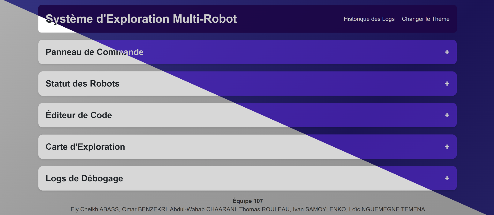
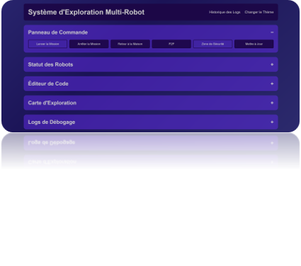
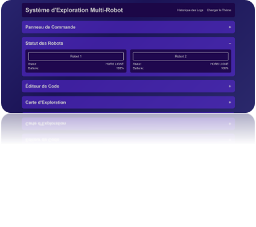
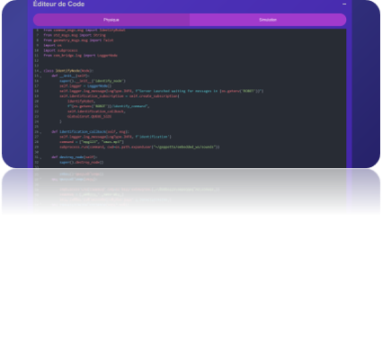
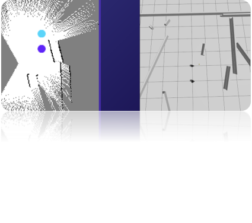
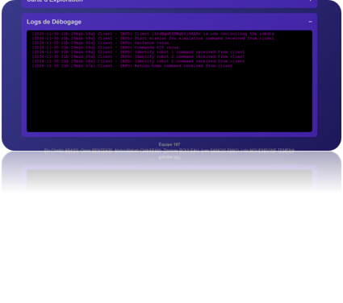
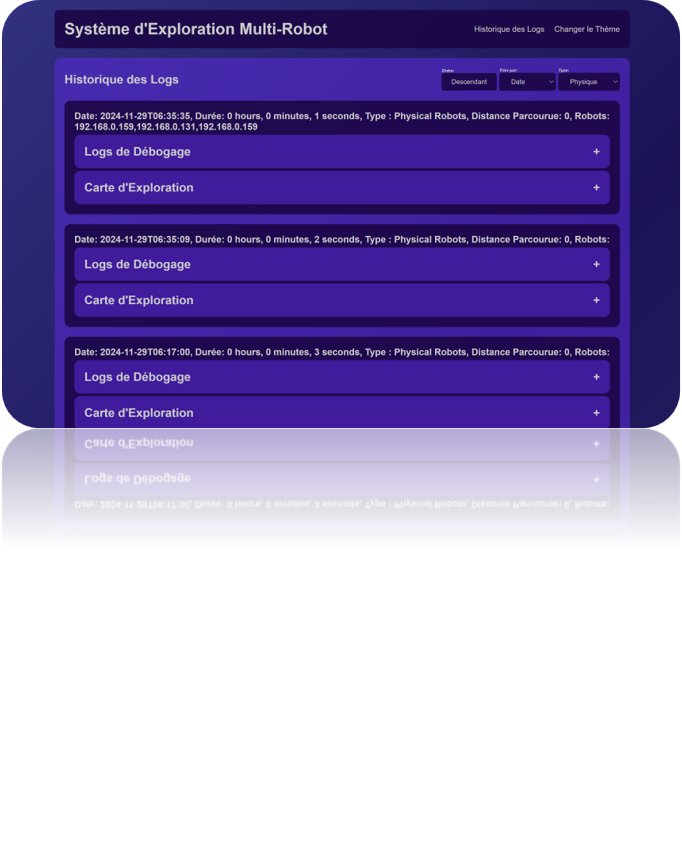

# ROBO-QUEST: Multi-Robot Exploration System



## Table of Contents
1. [Project Overview](#project-overview)
2. [Technologies and Architecture](#technologies-and-architecture)
3. [Features](#features)
   - [Command Board](#command-board)
   - [Robot Status](#robot-status)
   - [Code Editor](#code-editor)
   - [Exploration Map](#exploration-map)
   - [Debugging Logs](#debugging-logs)
   - [Log History](#log-history)
   - [Light and Dark Modes](#light-and-dark-modes)
4. [Setup and Launch](#setup-and-launch)
   - [Prerequisites](#prerequisites)
   - [Setup Instructions](#setup-instructions)
5. [Usage](#usage)
6. [Contributors](#contributors)
7. [License](#license)

---

## Project Overview
**ROBO-QUEST** is a proof-of-concept project demonstrating a multi-robot exploration system capable of autonomously navigating and mapping unknown environments. Designed for research and educational purposes in space exploration, this system complies with the minimum sensor requirements of the Canadian Space Agency (CSA). The system enables real-time monitoring, control, and debugging through an interactive web interface.

Key features include:
- Real-time mapping of the exploration zone.
- Autonomous collaboration between robots via peer-to-peer (P2P) communication.
- Advanced command and control functionalities for mission execution.
- Persistent storage of exploration data using MongoDB for analysis and debugging.

---

## Technologies and Architecture
The project integrates several advanced technologies:
- **ROS (Robot Operating System)**: Manages robot control, communication, and sensor data processing.
- **Embedded Python Code**: Executes controller logic and robot-specific functions.
- **WebSockets**: Facilitates real-time bidirectional communication between the robots, server, and client.
- **Frontend**: Angular-based web interface for user interaction and real-time monitoring.
- **Backend**: NestJS API serving as the middleware between ROS nodes, MongoDB, and the client.
- **MongoDB**: Persistent storage for mission data, logs, and exploration maps.
- **Docker**: Simplifies deployment with containerized services for the frontend, backend, and simulation.

---

## Features

### Command Board
The command board is the control hub for mission management. It includes:
- **Start Mission**: Initiates the exploration process.
- **End Mission**: Halts the exploration.
- **Return Home**: Commands the robots to return to their starting positions.
- **P2P Communication**: Enables robots to share data and determine which is furthest from the ground station, displaying results on their respective screens.
- **Set Geofence**: Defines the boundary within which robots must operate.
- **Update Controller Code**: Allows real-time updates to the robots' Python-based control logic.



---

### Robot Status
This component provides real-time status updates, including:
- **Battery Level**: Displays the battery status of both robots.
- **Robot Status**: Reports operational status and alerts.
- **Identify Command**: Allows users to visually identify a specific robot in the field.



---

### Code Editor
The code editor enables dynamic updates to the controller code, which can be applied to either the simulation or physical robots in real-time. This feature is essential for testing and deploying new exploration algorithms.



---

### Exploration Map
The exploration map visualizes the environment in real-time, including:
- **Generated Map**: Displays the layout of the explored area.
- **Robot Positions**: Updates robot positions live as they navigate the environment.



---

### Debugging Logs
This component logs every event and action during a mission, including:
- Mission start and end times.
- Command execution (e.g., Start Mission, Set Geofence).
- Robot communication and status updates.
Logs are automatically cleared at the start of a new mission.



---

### Log History
The **Historique des Logs** page provides a detailed record of past missions, allowing for:
- **Filtering and Sorting**: Search logs by attributes like mission duration, errors, or map size.
- **Data Inspection**: View logs, maps, and mission metadata stored in MongoDB.



---

### Light and Dark Modes
The web interface supports both light and dark themes for enhanced user experience and accessibility.

---

## Setup and Launch

### Prerequisites
- Docker installed on your system.
- MongoDB installed and configured.

### Setup Instructions
1. **Clone the Repository**:
   ```bash
   git clone https://github.com/your-repo/ROBO-QUEST.git
   cd ROBO-QUEST
   ```

2. **Start Services**:
   Run the following script to start the system:
   ```bash
   ./start.sh
   ```

3. **Access the Interface**:
   - Server: [http://localhost:3000](http://localhost:3000)
   - Client: [http://localhost:4200](http://localhost:4200)

---

## Usage
1. **Launch the System**: Start the backend, client, and simulation environment using Docker.
2. **Initiate a Mission**: Use the command board to start, control, and end missions.
3. **Analyze Data**: Review real-time data on the exploration map and robot status components.
4. **Inspect Logs**: Access mission logs and metadata via the debugging logs and log history pages.

---

## Contributors
- **Ely Cheikh Abyss**
- **Omar Benzekri**
- **Abdul-Wahab Chaarani**
- **Loïc Nguemegne**
- **Thomas Rouleau**
- **Ivan Samoylenko**

---

## License
This project is licensed under the MIT License. See the [LICENSE](LICENSE.txt) file for details.